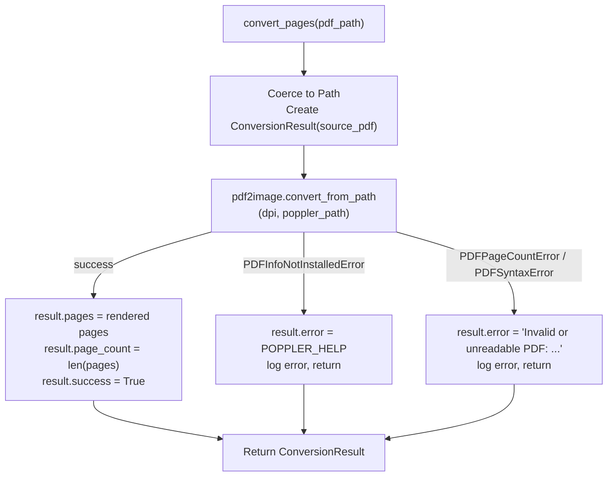

# Feature 1 — PDF-to-Images Conversion (`src/conversion.py`)

> Pipeline position: `convert` — first node. Every later node works per page image.

## Purpose

`src/conversion.py` is the Image Conversion Layer (the module calls itself "Core Component #2"). It turns one PDF document into a list of per-page, in-memory PIL images. Because every downstream feature (enhancement, quality assessment, routing, extraction, output) operates on page images, this conversion is the entry point of the whole pipeline: the LangGraph node `convert_node` in `src/pipeline_graph.py` invokes it first and passes its `pages` list into pipeline state as `images`.

The module is deliberately non-throwing for pipeline purposes: a broken PDF produces a failed `ConversionResult` with an `error` message instead of an exception, so one bad input can never crash the rest of a run.

## How It Works

1. **Entry point** — `ImageConversionLayer.convert_pages` (`src/conversion.py:58`) receives the PDF as a `Path | str`, coerces it with `Path(pdf_path)` (`src/conversion.py:63`), and creates an empty `ConversionResult(source_pdf=pdf_path)` (`src/conversion.py:64`). By default the result has `pages=[]`, `page_count=0`, `success=False`, `error=None`.
2. **Rendering** — the module calls `pdf2image.convert_from_path` (`src/conversion.py:67`) with `dpi=self.dpi` and `poppler_path=self.poppler_path`. Rendering is done by **Poppler** (the `pdftoppm`/`pdfinfo` tools) through the **pdf2image** wrapper; Poppler must either be on the system `PATH` or be located via the `POPPLER_PATH` environment variable (or the constructor argument).
3. **DPI behavior** — the render DPI is fixed per layer instance: it comes from the constructor (`dpi: int = 300`, `src/conversion.py:52`) and is passed unchanged to `convert_from_path`. In the pipeline, `convert_node` supplies `dpi=config.DPI` (`src/pipeline_graph.py:70`), i.e. the `DPI` value from `.env` (default `300`).
4. **Image format** — pages are returned as in-memory `PIL.Image.Image` objects (pdf2image's default; no format argument is passed). `src/conversion.py` does not select an output file format; the `IMAGE_FORMAT` setting (`src/config.py:38`) is only used later, by the output step, when naming saved page files (`page-NN.<format>`, `src/pipeline_graph.py:166`).
5. **Poppler location** — `ImageConversionLayer.__init__` stores `poppler_path` as the constructor argument, falling back to `os.getenv("POPPLER_PATH")` when the argument is `None` (`src/conversion.py:56`). Note this fallback reads the environment variable directly, not `config.POPPLER_PATH` (though both derive from the same `.env` key).
6. **Success path** — on a clean render, the module fills the result: `result.pages = pages`, `result.page_count = len(pages)`, `result.success = True` (`src/conversion.py:81`–`83`) and returns it.
7. **Failure paths** — three `pdf2image` exceptions are caught (see Error Handling below); in each case `result.error` is set, the failure is logged via the module logger, and the still-`success=False` result is returned.
8. **Pipeline integration** — `convert_node` (`src/pipeline_graph.py:65`) calls `ImageConversionLayer(dpi=config.DPI).convert_pages(state["pdf_path"])`. If `result.success` is false it returns `{"error": result.error or "conversion failed"}`; if `page_count == 0` it returns `{"error": "document has no pages"}`; otherwise it returns `{"images": result.pages}` into the graph state.

## Inputs & Outputs

| Direction | Name | Type | Description |
|---|---|---|---|
| Input | `pdf_path` (to `convert_pages`) | `Path \| str` | Path to the PDF file to render. Coerced to `Path`. |
| Input | `dpi` (constructor) | `int` (default `300`) | Render resolution passed to `convert_from_path`. |
| Input | `poppler_path` (constructor) | `str \| None` (default `None`) | Poppler `bin` folder; falls back to env `POPPLER_PATH`, otherwise Poppler must be on `PATH`. |
| Output | `ConversionResult.source_pdf` | `Path` | The PDF path, echoed back in the result. |
| Output | `ConversionResult.pages` | `list[PIL.Image.Image]` | One in-memory PIL image per rendered page (empty on failure). |
| Output | `ConversionResult.page_count` | `int` | `len(pages)`; `0` on failure. |
| Output | `ConversionResult.success` | `bool` | `True` only after a clean render. |
| Output | `ConversionResult.error` | `str \| None` | Failure message when `success` is `False`, else `None`. |

## Configuration

| `src/config.py` attribute | `.env` key | Default | Used here how |
|---|---|---|---|
| `DPI` | `DPI` | `"300"` (parsed as `int`) | Passed as `dpi` by `convert_node` (`src/pipeline_graph.py:70`). The class default is also `300`. |
| `POPPLER_PATH` | `POPPLER_PATH` | `None` (unset → Poppler must be on `PATH`) | `src/config.py:39` exposes it, but `src/conversion.py:56` reads `os.getenv("POPPLER_PATH")` directly; same `.env` key either way. |
| `IMAGE_FORMAT` | `IMAGE_FORMAT` | `"png"` | Not used by this module — only by the output step when saving page files (`src/pipeline_graph.py:166`). Documented here because it governs the on-disk form of these page images. |

All values come from the project `.env` file, loaded by `src/config.py` via `load_dotenv` (`src/config.py:17`).

## Error Handling & Edge Cases

| Case | Handling |
|---|---|
| Poppler not installed/found (`PDFInfoNotInstalledError`) | `result.error` is set to the module constant `POPPLER_HELP` (`src/conversion.py:31`) — a message telling the user to install Poppler for Windows and either add its `bin` folder to `PATH` or set `POPPLER_PATH` (example: `C:\poppler-26.02.0\Library\bin`). Logged as `logger.error("Poppler missing while converting %s", ...)` (`src/conversion.py:72`–`75`). |
| Broken/unreadable PDF (`PDFPageCountError`, `PDFSyntaxError`) | `result.error = f"Invalid or unreadable PDF: {exc}"`, logged, result returned with `success=False` (`src/conversion.py:76`–`79`). |
| Zero-page document | Not detected here — a successful call over zero pages would return `success=True, page_count=0`. The `convert_node` wrapper rejects `page_count == 0` with `"document has no pages"` (`src/pipeline_graph.py:73`–`74`). |
| Missing/nonexistent file path | Not explicitly caught; a missing file surfaces as `PDFPageCountError`/`PDFSyntaxError` from pdf2image and is reported as `"Invalid or unreadable PDF: ..."`. |
| Any other exception | Not caught — propagates to the caller. Only the three pdf2image exceptions above are handled. |
| Failure semantics | Failures never raise from `convert_pages`; they are returned as `result.error` so one broken PDF cannot crash the rest of the run (stated in the method docstring, `src/conversion.py:58`–`62`). |

## API Reference

| Symbol | Kind | Signature | Location |
|---|---|---|---|
| `ConversionResult` | `@dataclass` | `ConversionResult(source_pdf: Path, pages: list[Image.Image] = [], page_count: int = 0, success: bool = False, error: str \| None = None)` | `src/conversion.py:38` (fields at `src/conversion.py:42`–`46`) |
| `ImageConversionLayer` | class | `ImageConversionLayer(dpi: int = 300, poppler_path: str \| None = None)` | `src/conversion.py:49` |
| `ImageConversionLayer.__init__` | method | `__init__(self, dpi: int = 300, poppler_path: str \| None = None) -> None` | `src/conversion.py:52` |
| `ImageConversionLayer.convert_pages` | method | `convert_pages(self, pdf_path: Path \| str) -> ConversionResult` | `src/conversion.py:58` |
| `POPPLER_HELP` | module constant | `str` — Poppler-missing guidance message | `src/conversion.py:31` |
| `logger` | module logger | `logging.getLogger(__name__)` | `src/conversion.py:29` |

## Notes & Limitations

- **Whole document is rendered in one call.** `convert_from_path` renders every page before returning, so memory use grows with page count × DPI; there is no lazy/paged rendering or page-range selection.
- **No format/size control at conversion time.** The module passes only `dpi` and `poppler_path` to `convert_from_path` — no `fmt`, `output_folder`, `grayscale`, or size caps. Pages stay as in-memory PIL images until the output step saves them (format chosen there via `IMAGE_FORMAT`, default PNG).
- **`success=True` does not guarantee pages exist.** An empty PDF yields `success=True, page_count=0`; the zero-page guard lives in `convert_node`, not in this module.
- **Poppler is a hard external dependency.** Without Poppler (PATH or `POPPLER_PATH`), every conversion fails with `POPPLER_HELP`; the message is Windows-oriented but the mechanism (`poppler_path` passed to pdf2image) is cross-platform.
- **Env fallback bypasses `config`.** The constructor reads `POPPLER_PATH` via `os.getenv` directly, so a programmatic `config.POPPLER_PATH` change would not be picked up by a default-constructed layer — only the `.env`/environment value or the explicit constructor argument matters.
- **Thread/process model is pdf2image's default.** No `thread_count` is set, so pdf2image uses its own default process-based conversion.
