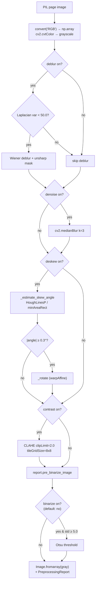

# Feature 2 — Image Enhancement (`src/preprocessing.py`)

> Pipeline position: `enhance` — second node. Cleans each page image before quality assessment and extraction.

## Purpose

`src/preprocessing.py` implements the **Image Preprocessing Engine** (module docstring: "Core Component #3"), a classical OpenCV cleanup chain that improves the readability of each PDF page image before the quality assessment and the vision-model extraction see it. The goal is that OCR and the vision model read tilted, blurry, noisy, or low-contrast scans "as clearly as possible" (`enhance_node` docstring, `src/pipeline_graph.py:79-80`). The engine works on one PIL image at a time and runs entirely on the CPU with OpenCV, NumPy, and Pillow — no AI model is involved.

## How It Works

The single entry point `enhance_with_report()` (`src/preprocessing.py:69`) runs the following steps in fixed order. Every step except grayscale is individually switchable via constructor flags; the pipeline uses the defaults (`ImagePreprocessingEngine()` at `src/pipeline_graph.py:82`).

1. **RGB normalization + grayscale** (`src/preprocessing.py:76-78`) — the input PIL image is converted with `image.convert("RGB")` and turned into a NumPy array, then `cv2.cvtColor(rgb, cv2.COLOR_RGB2GRAY)` produces the single-channel working image. Always applied; recorded as `"grayscale"` in the report.
2. **Deblurring — adaptive** (`src/preprocessing.py:80-86`, flag `deblur`, default `True`) — sharpness is measured as the variance of `cv2.Laplacian(gray, cv2.CV_64F)`. Only if it is **below 50.0** (`_BLUR_LAPLACIAN_THRESHOLD`, `src/preprocessing.py:32`) the page is treated as blurry and two operations run:
   - `_wiener_deblur()` (`src/preprocessing.py:173`) — frequency-domain Wiener deconvolution with a Gaussian PSF (`psf_sigma=2.0`, `noise_ratio=0.02`). The PSF kernel size is `max(3, int(psf_sigma * 6) | 1)` = 13 px, normalized and rolled to the FFT center; the filter is `conj(otf) / (|otf|² + noise_ratio)` applied via `np.fft.fft2`/`np.fft.ifft2`, then clipped to 0–255 (`uint8`).
   - `_unsharp_mask()` (`src/preprocessing.py:200`) — `cv2.GaussianBlur(gray, (0, 0), sigmaX=2.0)` blended back with `cv2.addWeighted(gray, 2.0, blurred, -1.0, 0)` (`amount=1.0`, `sigma=2.0`).
   - Sharp pages are never touched; the report records `"deblur(wiener+unsharp)"` or `"deblur(skipped: already sharp)"`.
3. **Denoising** (`src/preprocessing.py:88-90`, flag `denoise`, default `True`) — a single edge-preserving median filter, `cv2.medianBlur(gray, 3)` (kernel size 3), recorded as `"denoise(median)"`.
4. **Deskewing** (`src/preprocessing.py:92-100`, flag `deskew`, default `True`) — the skew angle is estimated by `_estimate_skew_angle()` (`src/preprocessing.py:120`):
   - an ink mask is built with `cv2.threshold(gray, 0, 255, cv2.THRESH_BINARY_INV + cv2.THRESH_OTSU)`, then `cv2.Canny(ink, 50, 150, apertureSize=3)`;
   - `cv2.HoughLinesP(edges, rho=1, theta=np.pi/180, threshold=80, minLineLength=max(50, gray.shape[1] // 20), maxLineGap=30)` detects text lines; each line's angle is `np.degrees(np.arctan2(y2 - y1, x2 - x1))`, angles with `|angle| ≤ 45°` are kept and their **median** becomes the skew estimate;
   - when no usable lines are found, a fallback fits `cv2.minAreaRect` to the ink pixel coordinates (`src/preprocessing.py:146-155`), normalizing the rect angle (`< -45° → -(90 + angle)`, else `-angle`); a completely blank mask returns `0.0`.
   - If `|angle| >= 0.3°` (`MIN_DESKEW_ANGLE_DEG`, `src/preprocessing.py:31`), `_rotate()` (`src/preprocessing.py:158`) straightens the page with `cv2.getRotationMatrix2D((width // 2, height // 2), angle, 1.0)` + `cv2.warpAffine(..., flags=cv2.INTER_CUBIC, borderMode=cv2.BORDER_CONSTANT, borderValue=255)` (white background). Otherwise it is skipped. The report stores `deskew_angle` and an entry like `"deskew(+1.23deg)"` / `"deskew(skipped: already straight)"`; an applied deskew is logged at INFO level (`src/preprocessing.py:98`).
5. **Contrast enhancement — CLAHE** (`src/preprocessing.py:102-105`, flag `enhance_contrast`, default `True`) — `cv2.createCLAHE(clipLimit=2.0, tileGridSize=(8, 8))` applied via `clahe.apply(gray)`, recorded as `"contrast(CLAHE)"`.
6. **Pre-binarize snapshot** (`src/preprocessing.py:107`) — `report.pre_binarize_image = Image.fromarray(gray.copy())` always captures the image after step 5, before the optional destructive step 7.
7. **Binarization — opt-in, OFF by default** (`src/preprocessing.py:109-116`, flag `binarize`, default `False`) — blank pages are protected: if `gray.std() < 5.0` the step is skipped (`"binarize(skipped: blank page)"`); otherwise Otsu thresholding `cv2.threshold(gray, 0, 255, cv2.THRESH_BINARY + cv2.THRESH_OTSU)` runs (`"binarize(otsu)"`).

Finally the method returns `Image.fromarray(gray)` (a grayscale PIL image) together with the `PreprocessingReport`. The image-only wrapper `enhance()` (`src/preprocessing.py:63`) discards the report.

## Inputs & Outputs

| Direction | Name | Type | Description |
|---|---|---|---|
| Input | `image` | `PIL.Image.Image` | One page image as produced by the `convert` node (`ImageConversionLayer`, PNG at `config.DPI`); any PIL mode is accepted because `enhance_with_report` calls `image.convert("RGB")` first (`src/preprocessing.py:76`). |
| Output (both methods) | enhanced image | `PIL.Image.Image` | Single-channel (grayscale) result of `Image.fromarray(gray)` (`src/preprocessing.py:118`); consumed by `assess` and `extract`. |
| Output (`enhance_with_report` only) | `report` | `PreprocessingReport` | Dataclass (`src/preprocessing.py:36`) with `deskew_angle: float`, `steps_applied: list[str]` (human-readable log of what ran/skipped), and `pre_binarize_image: Image.Image \| None`. |

In the pipeline, `enhance_node` (`src/pipeline_graph.py:78-83`) maps `state["images"]` to `state["enhanced"]` with `engine.enhance(image)` per page — the diagnostics report is not kept.

## Configuration

This feature reads **no `src/config.py` attributes and no `.env` keys directly** — all knobs are constructor arguments on `ImagePreprocessingEngine` (see API Reference). Two related settings exist in `src/config.py` but live outside the module:

| Setting | Location | Default | Relation to this feature |
|---|---|---|---|
| `OCR_CONCURRENCY` | `src/config.py:40` (`OCR_CONCURRENCY` in `.env`) | `4` | **Not used here** — it bounds the parallel pytesseract calls in `src/quality.py:68`. The enhance node processes pages sequentially in a list comprehension. |
| `OMP_THREAD_LIMIT` | `src/config.py:71` (`os.environ.setdefault("OMP_THREAD_LIMIT", "1")`) | `1` | Set process-wide before OpenCV/NumPy initialize their thread pools, indirectly capping the threading of the OpenCV/FFT calls in this module. Not read by `preprocessing.py` itself. |
| Pipeline flag usage | `src/pipeline_graph.py:82` | all defaults | `ImagePreprocessingEngine()` with no arguments: denoise/deskew/enhance_contrast/deblur on, binarize off. |

Module-level thresholds (not configurable via `.env`): `MIN_DESKEW_ANGLE_DEG = 0.3` (`src/preprocessing.py:31`), `_BLUR_LAPLACIAN_THRESHOLD = 50.0` (`src/preprocessing.py:32`).

## Error Handling & Edge Cases

- **No try/except in the module** — malformed images or OpenCV errors propagate to the caller; `enhance_node` (`src/pipeline_graph.py:78-83`) does not catch them either, so a failure aborts the run (unlike `convert_node`, which records `error` in state).
- **Sharp pages are protected** from deblurring: Wiener + unsharp run only when the Laplacian variance is below 50.0, so already-sharp pages are never "damaged" (docstring `src/preprocessing.py:178-179`).
- **Tiny rotations are ignored**: deskew is skipped when `|angle| < 0.3°`, avoiding interpolation loss on straight pages.
- **No lines found** during skew estimation falls back to `cv2.minAreaRect` over ink pixels; if there are **no ink pixels at all**, the angle is `0.0` (`src/preprocessing.py:147-148`) and no rotation happens.
- **Blank-page guard on binarize**: `gray.std() < 5.0` skips Otsu so near-empty pages are not turned into solid black/white.
- **Binarize disabled by default** because "it can destroy grey photos" (constructor docstring `src/preprocessing.py:55-56`).
- **Input mode handling**: `image.convert("RGB")` normalizes RGBA/palette/1-bit inputs before grayscaling.
- **`pre_binarize_image`** is always populated (even when `binarize` is off), giving callers a non-destructive copy of the fully cleaned image.
- **Rotation canvas** keeps the original `(width, height)`; corners that rotate outside the frame are cropped and the exposed border is filled with white (`borderValue=255`).

## API Reference

Public surface of `src/preprocessing.py`:

| Symbol | Signature | Line | Description |
|---|---|---|---|
| `PreprocessingReport` | `@dataclass` — fields: `deskew_angle: float = 0.0`, `steps_applied: list[str]`, `pre_binarize_image: Image.Image \| None = None` | `src/preprocessing.py:36` | Per-image diagnostics: which steps ran/skipped, measured skew, optional pre-binarize snapshot. |
| `ImagePreprocessingEngine` | class | `src/preprocessing.py:44` | Classical OpenCV enhancement engine; one instance per enhance node call. |
| `ImagePreprocessingEngine.__init__` | `__init__(self, denoise: bool = True, deskew: bool = True, enhance_contrast: bool = True, deblur: bool = True, binarize: bool = False) -> None` | `src/preprocessing.py:47` | Each pipeline step is an individual switch. |
| `ImagePreprocessingEngine.enhance` | `enhance(self, image: Image.Image) -> Image.Image` | `src/preprocessing.py:63` | Image-only entry point used by `enhance_node`; discards the report. |
| `ImagePreprocessingEngine.enhance_with_report` | `enhance_with_report(self, image: Image.Image) -> tuple[Image.Image, PreprocessingReport]` | `src/preprocessing.py:69` | Runs the full chain and returns the result plus the `PreprocessingReport`. |

Private helpers (implementation detail, listed for reference):

| Symbol | Signature | Line | Description |
|---|---|---|---|
| `_estimate_skew_angle` | `_estimate_skew_angle(self, gray: np.ndarray) -> float` | `src/preprocessing.py:120` | Hough-line median angle with `minAreaRect` fallback. |
| `_rotate` | `@staticmethod _rotate(gray: np.ndarray, angle: float) -> np.ndarray` | `src/preprocessing.py:158` | Rotates the page via `warpAffine` (cubic, white border). |
| `_wiener_deblur` | `@staticmethod _wiener_deblur(gray: np.ndarray, psf_sigma: float = 2.0, noise_ratio: float = 0.02) -> np.ndarray` | `src/preprocessing.py:173` | Frequency-domain Wiener deconvolution with a Gaussian PSF. |
| `_unsharp_mask` | `@staticmethod _unsharp_mask(gray: np.ndarray, amount: float = 1.0, sigma: float = 2.0) -> np.ndarray` | `src/preprocessing.py:200` | Gaussian-blur-based unsharp masking. |

Module constants: `MIN_DESKEW_ANGLE_DEG = 0.3` (`src/preprocessing.py:31`), `_BLUR_LAPLACIAN_THRESHOLD = 50.0` (`src/preprocessing.py:32`).

## Notes & Limitations

- **Classical CV only** — OpenCV, NumPy, and Pillow; no learned models, so enhancement is fast and deterministic but cannot repair severe damage (e.g. heavy motion blur beyond the Wiener model, torn pages).
- **Sequential, per-page** — `enhance_node` processes pages one after another in a list comprehension (`src/pipeline_graph.py:83`); there is no concurrency here even though `OCR_CONCURRENCY` exists for the assessment stage.
- **Fixed output size** — `_rotate` keeps the input dimensions, so rotated content near the corners is clipped rather than expanded.
- **Hard-coded thresholds** — blur (50.0), deskew (0.3°), blank-page std (5.0), Hough (80/30, `minLineLength = max(50, w // 20)`), CLAHE (2.0 / 8×8), Wiener (σ=2.0, noise 0.02) are constants or default arguments; tuning them requires code changes, not `.env` edits.
- **Grayscale output** — the returned image is single-channel (color information is dropped at step 1), which is intentional for document OCR but makes the engine unsuitable for color-preserving use cases; `report.pre_binarize_image` is likewise grayscale.
- **Binarize is deliberately off by default** — enabling it destroys greyscale photos on mixed documents.
- **Report is unused in the pipeline** — `enhance_node` calls `enhance()`, so `PreprocessingReport` (including the `logger.info` deskew message) is only available to direct callers of `enhance_with_report`.
