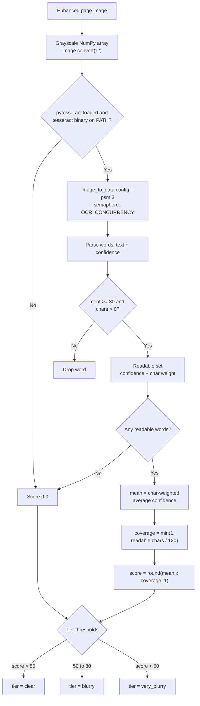

# Feature 3 — Quality Assessment (`src/quality.py`)

> Pipeline position: `assess` — third node. Scores every enhanced page 0–100 and assigns a quality tier.

## Purpose

`src/quality.py` grades each enhanced page image before extraction. It computes a 0–100 quality score purely from Tesseract OCR per-word confidences and maps that score to one of three tiers — `clear`, `blurry`, `very_blurry` — which the model router (Feature 4) uses to select the extraction model, so clear pages run on the cheap model and only hard pages pay for the strong one. The result is returned as a small `QualityAssessment` dataclass (`score` + `tier`) and written into the pipeline state as `assessments`, one entry per page.

## How It Works

The score is OCR-confidence-based only — the engine never measures sharpness directly; "quality" means "how confidently Tesseract reads the page text" ([quality.py:53](../../src/quality.py#L53)).

1. `assess()` ([quality.py:71](../../src/quality.py#L71)) receives one enhanced page as a `PIL.Image.Image` and converts it to 8-bit grayscale, flattened to a NumPy array: `gray = np.array(image.convert("L"))` ([quality.py:75](../../src/quality.py#L75)).
2. `_ocr_confidence_score(gray)` ([quality.py:87](../../src/quality.py#L87)) runs next. If `pytesseract` was never loaded (`self._pytesseract is None`, [quality.py:92-L93](../../src/quality.py#L92-L93)) it returns `0.0` immediately, without calling Tesseract.
3. Under an instance semaphore of capacity `config.OCR_CONCURRENCY` (default `4`, [quality.py:96](../../src/quality.py#L96)), it calls `pytesseract.image_to_data(gray, output_type=Output.DICT, config="--psm 3")` ([quality.py:97-L101](../../src/quality.py#L97-L101)), producing per-word `text` and `conf` arrays. Each call is an independent Tesseract subprocess.
4. Word-cleaning loop ([quality.py:108-L129](../../src/quality.py#L108-L129)): strips whitespace from each word and skips empty words ([quality.py:112-L114](../../src/quality.py#L112-L114)), non-numeric confidences ([quality.py:115-L118](../../src/quality.py#L115-L118)), negative confidences — the `-1` placeholders pytesseract emits for non-word blocks ([quality.py:119-L120](../../src/quality.py#L119-L120)) — and words with zero non-space characters (`char_count = len("".join(text.split()))`, [quality.py:121](../../src/quality.py#L121)). Each surviving confidence is clipped to `[0, 100]` ([quality.py:124](../../src/quality.py#L124)).
5. Readable-word filter: words with clipped confidence **≥ 30.0** (`READABLE_MIN_CONFIDENCE`, [quality.py:40](../../src/quality.py#L40), applied at [quality.py:127](../../src/quality.py#L127)) are kept in the "readable" set along with their character counts as weights, so junk words (stamps, borders, handwriting) below the floor cannot inflate the score. (All valid words also land in `all_confidences`/`all_char_weights`, [quality.py:125-L126](../../src/quality.py#L125-L126), but those lists are not used in the score.)
6. If the readable set is empty ([quality.py:131-L132](../../src/quality.py#L131-L132)) the score is `0.0` — a page with no confidently readable text never scores high.
7. **Mean confidence** = character-weighted average of readable words: `np.average(readable_confidences, weights=readable_char_weights)` ([quality.py:134-L136](../../src/quality.py#L134-L136)) — longer words count proportionally more.
8. **Coverage factor** = `min(1.0, sum(readable_char_weights) / 120.0)` ([quality.py:137](../../src/quality.py#L137)), where `COVERAGE_TARGET_CHARS = 120.0` ([quality.py:41](../../src/quality.py#L41)) — readable-text coverage scaled down for nearly empty pages, capped at `1.0`.
9. **Score** = `mean_confidence * coverage` ([quality.py:138](../../src/quality.py#L138)), clipped to `[0, 100]` ([quality.py:140](../../src/quality.py#L140)), then rounded to one decimal back in `assess()` ([quality.py:76](../../src/quality.py#L76)):

   `score = round(clip(charWeightedMeanConfidence × min(1, readableChars / 120), 0, 100), 1)`

10. **Tier assignment** ([quality.py:78-L83](../../src/quality.py#L78-L83)), using the rounded score and the constructor thresholds:
    - `score > 80.0` (`clear_threshold`, strict `>`) → `clear`
    - `50.0 ≤ score ≤ 80.0` (`score >= blurry_threshold`) → `blurry`
    - `score < 50.0` → `very_blurry`
11. Returns `QualityAssessment(score=score, tier=tier)` ([quality.py:85](../../src/quality.py#L85)) — the dataclass holds exactly these two fields: `score: float` and `tier: str` ([quality.py:44-L49](../../src/quality.py#L44-L49)).

**Pipeline integration.** `assess_node` ([pipeline_graph.py:86](../../src/pipeline_graph.py#L86)) creates `QualityAssessmentEngine()` with the constructor defaults, calls `assess()` on every image in `state["enhanced"]`, prints one line per page (`page N: score X -> tier`), and returns `{"assessments": [{"page", "score", "tier"}, ...]}` for the `assessments` field of `PipelineState` ([pipeline_graph.py:52](../../src/pipeline_graph.py#L52)). `route_node` then rebuilds `QualityAssessment(score=..., tier=...)` from those dicts ([pipeline_graph.py:109](../../src/pipeline_graph.py#L109)) and passes it to `ModelRouter.route()` ([router.py:52](../../src/router.py#L52)), which maps `assessment.tier` to a model via `config.TIER_MODEL_MAP` and echoes `assessment.score` into the `RoutingDecision`. The output node embeds `quality_score`/`quality_tier` in each page's result ([pipeline_graph.py:173-L174](../../src/pipeline_graph.py#L173-L174)).

## Inputs & Outputs

| Direction | Name | Type | Description |
|---|---|---|---|
| Input | `image` | `PIL.Image.Image` | One enhanced page image (from `state["enhanced"]`, Feature 2 output). |
| Input | `clear_threshold` | `float = 80.0` | Constructor param; upper tier boundary (strict `>`). |
| Input | `blurry_threshold` | `float = 50.0` | Constructor param; lower tier boundary (`>=`). |
| Input | `ocr_config` | `str = "--psm 3"` | Tesseract config passed to `image_to_data` (page-segmentation mode). |
| Output | `QualityAssessment.score` | `float` | Quality score 0–100, rounded to 1 decimal. |
| Output | `QualityAssessment.tier` | `str` | `"clear"` \| `"blurry"` \| `"very_blurry"`. |
| Output (pipeline) | `state["assessments"]` | `list[dict]` | `[{"page": int, "score": float, "tier": str}, ...]` — one entry per page; consumed by `route_node` and the output node. |

## Configuration

| Setting | Source | Default | Used for |
|---|---|---|---|
| `OCR_CONCURRENCY` | `.env` → `config.OCR_CONCURRENCY` ([config.py:40](../../src/config.py#L40)) | `4` | Capacity of the semaphore limiting parallel Tesseract subprocesses. |
| `clear_threshold` | constructor arg ([quality.py:57](../../src/quality.py#L57)) | `80.0` | `clear` tier boundary (`score > 80`). Code default only — not in `.env`; `assess_node` uses the default. |
| `blurry_threshold` | constructor arg ([quality.py:58](../../src/quality.py#L58)) | `50.0` | `blurry` / `very_blurry` boundary (`score >= 50`). Code default only — not in `.env`. |
| `ocr_config` | constructor arg ([quality.py:59](../../src/quality.py#L59)) | `"--psm 3"` | Tesseract page-segmentation mode. Code default only — not in `.env`. |
| `READABLE_MIN_CONFIDENCE` | module constant ([quality.py:40](../../src/quality.py#L40)) | `30.0` | Minimum per-word confidence for a word to count as "readable". |
| `COVERAGE_TARGET_CHARS` | module constant ([quality.py:41](../../src/quality.py#L41)) | `120.0` | Readable characters that reach full (1.0) coverage. |
| `TIER_CLEAR_MODEL` / `TIER_BLURRY_MODEL` / `TIER_VERY_BLURRY_MODEL` | `.env` → `config.TIER_MODEL_MAP` ([config.py:30-L34](../../src/config.py#L30-L34)) | `IMAGE_MODEL_SMALL` / `IMAGE_MODEL_MEDIUM` / `IMAGE_MODEL_LARGE` | Consumed downstream by `ModelRouter`, not by `quality.py` itself; listed because the tier names defined here are the map's keys. |

`.env.example` exposes `OCR_CONCURRENCY=4` and the three `TIER_*_MODEL` keys (the only quality-related `.env` key read by `quality.py` is `OCR_CONCURRENCY`).

**External dependencies:** the **Tesseract OCR binary must be on `PATH`** — checked at startup with `shutil.which("tesseract")` ([quality.py:157](../../src/quality.py#L157)) — plus the `pytesseract` Python package ([quality.py:150](../../src/quality.py#L150)), `numpy` and `Pillow`. If Tesseract or pytesseract is missing, the module logs a warning and every page scores `0`; the pipeline still runs without OCR.

## Error Handling & Edge Cases

| Situation | Behavior | Where |
|---|---|---|
| `pytesseract` not installed | Logs `"pytesseract not installed - OCR confidence will be 0."`; `_pytesseract` stays `None` | [quality.py:149-L155](../../src/quality.py#L149-L155) |
| `tesseract` binary not on `PATH` | Logs `"Tesseract binary not found on PATH - OCR confidence will be 0."`; OCR disabled | [quality.py:157-L161](../../src/quality.py#L157-L161) |
| OCR disabled (`_pytesseract is None`) | `_ocr_confidence_score` returns `0.0` without calling Tesseract | [quality.py:92-L93](../../src/quality.py#L92-L93) |
| Any exception during OCR/scoring | Caught broadly, logged as `"OCR-confidence metric failed: %s"`, returns `0.0` — `assess()` never raises | [quality.py:142-L144](../../src/quality.py#L142-L144) |
| Missing `text`/`conf` arrays in OCR data | `data.get(..., [])` tolerates missing keys | [quality.py:108-L111](../../src/quality.py#L108-L111) |
| Empty / whitespace-only word | Skipped | [quality.py:112-L114](../../src/quality.py#L112-L114) |
| Non-numeric confidence | Skipped (`TypeError`/`ValueError` caught) | [quality.py:115-L118](../../src/quality.py#L115-L118) |
| Negative confidence (pytesseract `-1` for non-word blocks) | Skipped | [quality.py:119-L120](../../src/quality.py#L119-L120) |
| Word with zero non-space characters | Skipped | [quality.py:121-L123](../../src/quality.py#L121-L123) |
| Confidence outside 0–100 | Clipped via `np.clip(conf, 0, 100)` | [quality.py:124](../../src/quality.py#L124) |
| No readable words at all | Score `0.0` → tier `very_blurry` (since 0 < 50) | [quality.py:131-L132](../../src/quality.py#L131-L132) |
| Score out of range | Final score clipped to `[0, 100]` | [quality.py:140](../../src/quality.py#L140) |
| Score exactly `80.0` or `50.0` | `80.0` → `blurry` (clear needs strict `>`); `50.0` → `blurry` (`>=` keeps it above `very_blurry`) | [quality.py:78-L83](../../src/quality.py#L78-L83) |
| Blank page / photo with no text | Falls out of the above: no readable words → `0.0` → `very_blurry` | — |

## API Reference

Public surface of `src/quality.py`:

| Name | Signature / Value | Location |
|---|---|---|
| `QualityAssessment` | `@dataclass`, fields `score: float`, `tier: str` | `src/quality.py:44` |
| `QualityAssessmentEngine` | class — "Scores page-image quality using Tesseract OCR confidence only." | `src/quality.py:52` |
| `QualityAssessmentEngine.__init__` | `(clear_threshold: float = 80.0, blurry_threshold: float = 50.0, ocr_config: str = "--psm 3") -> None` | `src/quality.py:55` |
| `QualityAssessmentEngine.assess` | `(image: Image.Image) -> QualityAssessment` | `src/quality.py:71` |
| `TIER_CLEAR` | `= "clear"` | `src/quality.py:36` |
| `TIER_BLURRY` | `= "blurry"` | `src/quality.py:37` |
| `TIER_VERY_BLURRY` | `= "very_blurry"` | `src/quality.py:38` |
| `READABLE_MIN_CONFIDENCE` | `= 30.0` | `src/quality.py:40` |
| `COVERAGE_TARGET_CHARS` | `= 120.0` | `src/quality.py:41` |

Private helpers (implementation detail):

| Name | Signature | Location |
|---|---|---|
| `QualityAssessmentEngine._ocr_confidence_score` | `(gray: np.ndarray) -> float` | `src/quality.py:87` |
| `QualityAssessmentEngine._init_ocr` | `() -> None` | `src/quality.py:146` |

## Notes & Limitations

- **Purely OCR-based.** Sharpness is never measured directly — "quality" means "how confidently Tesseract reads the text". A crisp photo of a blank page or a text-free diagram has no readable words and therefore scores `0`, landing in `very_blurry`.
- **Coverage penalty.** Pages with fewer than 120 readable characters are scaled down proportionally (`readableChars / 120`), so sparse pages cannot reach a high score even at perfect confidence.
- **Boundary semantics.** Exactly `80.0` is `blurry`, not `clear` (strict `>` at [quality.py:78](../../src/quality.py#L78)); the score is rounded to 1 decimal *before* tiering ([quality.py:76](../../src/quality.py#L76)), so a raw `80.04` becomes `80.0` → `blurry`.
- **Dead collection.** `all_confidences` / `all_char_weights` ([quality.py:125-L126](../../src/quality.py#L125-L126)) are populated but never used in the score — only readable words (confidence ≥ 30) contribute.
- **Graceful degradation is costly.** Without Tesseract/pytesseract every page scores `0` → `very_blurry` → the router sends all pages to the large model (`TIER_VERY_BLURRY_MODEL`). Watch the two startup warnings from `_init_ocr`.
- **Concurrency scope.** The semaphore is per-engine instance; `assess_node` builds a fresh `QualityAssessmentEngine()` per run ([pipeline_graph.py:90](../../src/pipeline_graph.py#L90)), so parallelism is capped per pipeline run (default 4 concurrent Tesseract subprocesses), not globally.
- **Few knobs in `.env`.** Thresholds (80/50), the PSM mode, and the 30-confidence floor are constructor args / module constants; only `OCR_CONCURRENCY` is settable through `.env`. Changing tier boundaries means changing the `assess_node` construction call.
- **Layout assumption.** The default `--psm 3` (automatic page segmentation, no OSD) assumes a normal full page of text; unusual layouts (tables, crops) would need a different PSM via the constructor.
- Confidence values from Tesseract are already 0–100; the module clips defensively regardless.
