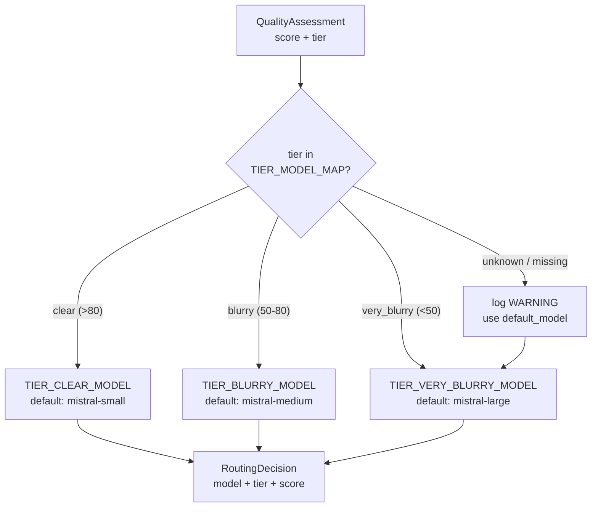

# Feature 4 — Model Router (`src/router.py`)

> Pipeline position: `route` — fourth node. Maps each page's quality tier to an extraction model so clear pages use the cheap model and only hard pages pay for the strong one.

## Purpose

The router turns each page's quality assessment (`score` + `tier` from Feature 3) into a concrete extraction model name. It is a pure, local decision — no API call is made for routing itself. The goal is cost/quality balance: clear pages are sent to the small model, blurry pages to the medium model, and only very blurry pages to the large model. The module also hosts `create_async_client()`, which builds the async OpenAI-compatible gateway client used later by extraction, so gateway settings are configured in one place.

## How It Works

1. **Mapping source.** `ModelRouter.__init__` copies the tier→model table from `config.TIER_MODEL_MAP` (`src/config.py:30-34`) into `self.tier_model_map`, unless an explicit `tier_model_map` argument is passed (`src/router.py:49`). The config map is populated from `.env` at import time:
   - `clear` → `TIER_CLEAR_MODEL` (default `IMAGE_MODEL_SMALL`)
   - `blurry` → `TIER_BLURRY_MODEL` (default `IMAGE_MODEL_MEDIUM`)
   - `very_blurry` → `TIER_VERY_BLURRY_MODEL` (default `IMAGE_MODEL_LARGE`)
2. **Default model.** `DEFAULT_MODEL` is computed at import time as `config.TIER_MODEL_MAP.get("very_blurry", "")` (`src/router.py:27`) — i.e. the strongest (large) model, so an unknown tier is handled by the model most likely to cope with it. `__init__` accepts a `default_model` override (`src/router.py:45`).
3. **Routing.** `route(assessment)` receives a `QualityAssessment` (`src/quality.py`) carrying `score: float` and `tier: str` (`src/router.py:52-68`). It looks up `assessment.tier` in `self.tier_model_map` (`src/router.py:56`).
4. **Fallback.** If no model is configured for the tier (`if not model`, `src/router.py:57`) — an unknown tier string or an empty mapping entry — the router logs a `WARNING` (`src/router.py:58-62`) and falls back to `self.default_model` (`src/router.py:63`) instead of crashing.
5. **Decision record.** The result is a `RoutingDecision` dataclass (`src/router.py:30-36`) with three fields: `model: str`, `tier: str`, `score: float` — the tier and score are echoed through unchanged (`src/router.py:64-68`).
6. **Integration.** In `route_node` (`src/pipeline_graph.py:101-120`) the graph builds one `ModelRouter()`, wraps each assessment dict into a `QualityAssessment`, calls `route()` per page, and writes `{page, model, tier, score}` dicts into the pipeline state's `routing` list. The `extract` node (`src/pipeline_graph.py:123+`) then rebuilds a `RoutingDecision` from those dicts and passes the chosen `model` to extraction.

**Tier → score → model table (as enforced by the code):**

| Score range | Tier (from `src/quality.py:78-83`) | Model (default from `src/config.py:30-34`) | `.env` key |
|---|---|---|---|
| `> 80` | `clear` | `IMAGE_MODEL_SMALL` → `mistralai/mistral-small-2603` | `TIER_CLEAR_MODEL` |
| `50–80` (i.e. `>= 50` and `<= 80`) | `blurry` | `IMAGE_MODEL_MEDIUM` → `mistralai/mistral-medium-3.5` | `TIER_BLURRY_MODEL` |
| `< 50` | `very_blurry` | `IMAGE_MODEL_LARGE` → `mistralai/mistral-large-2512` | `TIER_VERY_BLURRY_MODEL` |
| any other tier value | — | fallback `default_model` (=`very_blurry` model) | — |

Thresholds come from `QualityAssessmentEngine` (`clear_threshold=80.0`, `blurry_threshold=50.0`, `src/quality.py:57-58`): `score > 80` → `clear`, `score >= 50` → `blurry`, otherwise `very_blurry`. So a score of exactly 80 is `blurry`, and exactly 50 is also `blurry`.

## Inputs & Outputs

| Direction | Name | Type | Description |
|---|---|---|---|
| Input | `assessment` | `QualityAssessment` (`src/quality.py`) | Per-page result of the `assess` step: `score: float` (0–100) and `tier: str` (`clear` / `blurry` / `very_blurry`, or any other string) |
| Input (constructor) | `tier_model_map` | `dict[str, str] \| None` | Optional tier→model override; `None` (or a falsy dict) uses `config.TIER_MODEL_MAP` |
| Input (constructor) | `default_model` | `str` | Model used for unmapped tiers; defaults to `DEFAULT_MODEL` |
| Output | `route()` result | `RoutingDecision` | `model: str` (selected model id), `tier: str` (echoed input tier), `score: float` (echoed input score) |
| Output | `create_async_client()` result | `openai.AsyncOpenAI` | Async gateway client built from `config.API_KEY` / `config.BASE_URL` (used by extraction, not by routing) |

## Configuration

All values come from `.env` via `src/config.py`; nothing is hard-coded in the router.

| `src/config.py` attribute | `.env` key | Default | Purpose |
|---|---|---|---|
| `MODEL_IMAGE_SMALL` | `IMAGE_MODEL_SMALL` | `mistralai/mistral-small-2603` | Default model for `clear` pages (`src/config.py:27`) |
| `MODEL_IMAGE_MEDIUM` | `IMAGE_MODEL_MEDIUM` | `mistralai/mistral-medium-3.5` | Default model for `blurry` pages (`src/config.py:26`) |
| `MODEL_IMAGE_LARGE` | `IMAGE_MODEL_LARGE` | `mistralai/mistral-large-2512` | Default model for `very_blurry` pages (`src/config.py:25`) |
| `TIER_MODEL_MAP["clear"]` | `TIER_CLEAR_MODEL` | falls back to `MODEL_IMAGE_SMALL` | Explicit override of the `clear` tier model (`src/config.py:31`) |
| `TIER_MODEL_MAP["blurry"]` | `TIER_BLURRY_MODEL` | falls back to `MODEL_IMAGE_MEDIUM` | Explicit override of the `blurry` tier model (`src/config.py:32`) |
| `TIER_MODEL_MAP["very_blurry"]` | `TIER_VERY_BLURRY_MODEL` | falls back to `MODEL_IMAGE_LARGE` | Explicit override of the `very_blurry` tier model; also the source of `DEFAULT_MODEL` (`src/config.py:33`) |
| `API_KEY` | `API_KEY` | `""` | Gateway API key consumed by `create_async_client()` (`src/config.py:21`) |
| `BASE_URL` | `BASE_URL` | `""` | Gateway base URL consumed by `create_async_client()` (`src/config.py:22`) |

## Error Handling & Edge Cases

- **Unknown tier / missing map entry** (`src/router.py:56-63`): `route()` logs `logger.warning("No model configured for tier '%s'; falling back to %s", ...)` and returns a `RoutingDecision` built from `self.default_model`. The call never raises for an unrecognized tier.
- **Empty `tier_model_map` argument** (`src/router.py:49`): `dict(tier_model_map or config.TIER_MODEL_MAP)` treats an empty dict as falsy and silently falls back to the config map — passing `{}` does *not* disable routing, it reverts to `.env` defaults.
- **`DEFAULT_MODEL` evaluated at import time** (`src/router.py:27`): it snapshots `config.TIER_MODEL_MAP["very_blurry"]` when `src.router` is first imported; later mutation of `config.TIER_MODEL_MAP` does not change it (though a router built later would see the mutated map in `tier_model_map`).
- **Empty model strings**: if a tier maps to `""` (e.g. `TIER_VERY_BLURRY_MODEL=""` with `IMAGE_MODEL_LARGE=""`), the `if not model` check treats it as missing and falls back to `default_model` — which itself could then be `""`, producing a `RoutingDecision` with an empty model string. The router does no further validation.
- **`create_async_client()` does no validation** (`src/router.py:70-77`): it constructs `AsyncOpenAI(api_key=config.API_KEY, base_url=config.BASE_URL)` unconditionally; empty `API_KEY`/`BASE_URL` are not checked here, and failures surface only at extraction time. The `openai` import is deferred inside the method.

## API Reference

| Symbol | Signature | Description | Location |
|---|---|---|---|
| `DEFAULT_MODEL` | `str` (module constant) | `config.TIER_MODEL_MAP.get("very_blurry", "")`, captured at import time | `src/router.py:27` |
| `RoutingDecision` | `@dataclass` — fields `model: str`, `tier: str`, `score: float` | The model selected for one page; tier/score echo the input assessment | `src/router.py:30-36` |
| `ModelRouter` | class | Selects the extraction model for a page from its quality tier | `src/router.py:39` |
| `ModelRouter.__init__` | `__init__(self, tier_model_map: dict[str, str] \| None = None, default_model: str = DEFAULT_MODEL) -> None` | Builds the tier→model table (from `config.TIER_MODEL_MAP` when not given) and stores the fallback model | `src/router.py:42-50` |
| `ModelRouter.route` | `route(self, assessment: QualityAssessment) -> RoutingDecision` | Pure tier lookup; falls back to `default_model` with a warning for unmapped tiers | `src/router.py:52-68` |
| `ModelRouter.create_async_client` | `@staticmethod create_async_client() -> openai.AsyncOpenAI` | Builds the async OpenAI-compatible gateway client from `config.API_KEY` / `config.BASE_URL` for extraction | `src/router.py:70-77` |

## Notes & Limitations

- Routing is deterministic and free — one dict lookup per page; no network round-trip happens in `route()`.
- The router itself never inspects `score`; the score is only carried through in `RoutingDecision`. Tier assignment happens upstream in `src/quality.py` (`QualityAssessmentEngine.assess`), so all threshold logic lives in Feature 3, and this feature trusts the tier it is given.
- `create_async_client()` lives in this module only for configuration locality; it is unrelated to the routing decision and is consumed by the `extract` step.
- Model ids are free-form strings passed straight to the gateway — the router does not verify that a configured model name exists or is reachable.
- The fallback model is the `very_blurry` (largest) model, which is the safest for quality but the most expensive; a misconfigured tier therefore costs money rather than accuracy.
