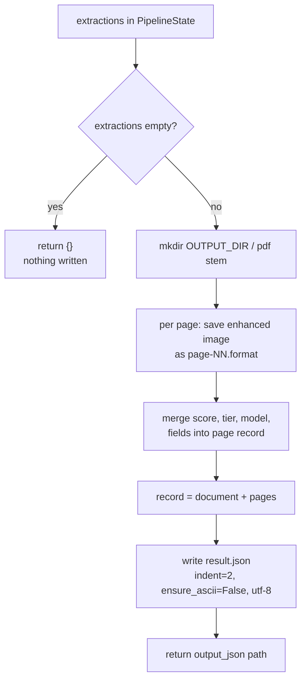

# Feature 6 — JSON Output (`src/pipeline_graph.py:output_node`)

> Pipeline position: `output` — final node. Writes enhanced page images and `result.json` per document; the web UI reads this file.

## Purpose

`output_node` is the persistence step of the pipeline. After extraction, all per-page data exists only in `PipelineState`; this node merges the assessment, routing and extraction results per page, saves each enhanced page image to disk, and writes the combined record to `result.json` — the single file the web UI (`app.py`) displays. It is the only node that touches the output filesystem, and it writes nothing at all when no pages were extracted.

## How It Works

1. **Guard — nothing extracted, nothing written** (`src/pipeline_graph.py:156`): `if not state.get("extractions"): return {}`. When the extractions list is empty or missing (e.g. an earlier node failed), the node returns an empty dict — no directory is created, no images are saved, no `result.json` is written, and the `[output] JSON output` progress line is not printed.
2. **Progress line** (`src/pipeline_graph.py:158`): `_show("output")` prints `  [output] JSON output` to the terminal.
3. **Output directory** (`src/pipeline_graph.py:159-161`): `pdf = Path(state["pdf_path"])`, then `directory = config.OUTPUT_DIR / pdf.stem` with `directory.mkdir(parents=True, exist_ok=True)`. The folder is named after the PDF filename **without** extension, e.g. `data/output/AL TAHER - 21543 1/` for `AL TAHER - 21543 1.pdf`.
4. **Per-page loop** (`src/pipeline_graph.py:164-181`), iterating `state["extractions"]` (one entry per page, produced by `extract_node`):
   - `index = item["page"] - 1` maps the 1-based page number to the 0-based position in the `enhanced`/`assessments` lists.
   - **Image naming** (`src/pipeline_graph.py:166-167`): `image_name = f"page-{item['page']:02d}.{config.IMAGE_FORMAT}"` (e.g. `page-01.png`, `page-02.png` — two-digit, zero-padded). The enhanced image `state["enhanced"][index]` (a PIL image) is saved at `directory / image_name`; PIL picks the encoder from the file extension.
   - **Merging** (`src/pipeline_graph.py:168-180`): `assessment = state["assessments"][index]` supplies `quality_score` and `quality_tier`; the extraction entry supplies `page`, `model`, `extracted_fields`, `field_confidence_scores`, `success` and `error`. The page image is saved and the page record is appended even when that page's extraction failed (`success: false`).
5. **Record and JSON encoding** (`src/pipeline_graph.py:183-187`): `record = {"document": pdf.name, "pages": pages}` — `document` keeps the full filename **with** extension (verified in a real result: `"AL TAHER - 21543 1.pdf"`). The file `result.json` is written with `write_text(json.dumps(record, indent=2, ensure_ascii=False), encoding="utf-8")`: 2-space indentation, `ensure_ascii=False` so non-ASCII text (e.g. Arabic names) stays literal rather than `\uXXXX`-escaped, UTF-8 file encoding.
6. **Return value** (`src/pipeline_graph.py:188`): `{"output_json": str(output_json)}` — the path to the written `result.json` — merged into `PipelineState`.
7. **Run-level flow** (`src/pipeline_graph.py:212-245`): `run()` compiles the graph once and invokes it per PDF with `{"pdf_path": str(pdf_path)}`. On success it prints `  => <output_json path>`; if `state.get("error")` is set (recorded by `convert_node` as `"conversion failed"` or `"document has no pages"`), the PDF is counted as failed and `  !! FAILED: <error>` is printed. After all PDFs it prints `Done. X succeeded, Y failed.` and returns `1 if failed else 0`. `main.py` passes this to `sys.exit(run(files))`, so the shell exit code is `0` when every document succeeded (or no PDFs were found) and `1` when at least one failed.



## Inputs & Outputs

| Name | Type | Role |
|---|---|---|
| `state["extractions"]` | `list[dict]` | Per-page results from `extract_node` (`page`, `model`, `extracted_fields`, `field_confidence_scores`, `success`, `error`). Guard input: empty/missing → node writes nothing and returns `{}`. |
| `state["pdf_path"]` | `str` | Input PDF path. `Path.stem` names the output folder; `Path.name` becomes the `document` field. |
| `state["enhanced"]` | `list` (PIL images) | Enhanced page images; `[page - 1]` is saved as `page-NN.<format>`. |
| `state["assessments"]` | `list[dict]` | Per-page `{"page", "score", "tier"}` from `assess_node`; `[page - 1]` supplies `quality_score` and `quality_tier`. |
| Return value | `dict` | `{"output_json": str}` — path to the written `result.json`; `{}` when nothing was written. |
| Files written | — | `data/output/<pdf stem>/page-NN.<format>` (one per page) and `data/output/<pdf stem>/result.json`. |

## Output Schema

`result.json` (verified against both the code and `data/output/AL TAHER - 21543 1/result.json`):

```json
{
  "document": "AL TAHER - 21543 1.pdf",
  "pages": [
    {
      "page": 1,
      "image": "page-01.png",
      "quality_score": 88.2,
      "quality_tier": "clear",
      "model": "qwen/qwen3.7-plus:free",
      "extracted_fields": {
        "document_no": "MHT21543/23",
        "buyer": "SEVEN SEAS SHIPCHANDLERS (LLC)"
      },
      "field_confidence_scores": {
        "document_no": 89,
        "buyer": 89
      },
      "success": true,
      "error": null
    }
  ]
}
```

| Field | Type | Meaning |
|---|---|---|
| `document` | `str` | Input PDF filename **with** extension (`Path.name`). |
| `pages` | `list` | One entry per page, in page order. |
| `pages[].page` | `int` | 1-based page number. |
| `pages[].image` | `str` | Image filename inside the same folder, `page-NN.<IMAGE_FORMAT>`. |
| `pages[].quality_score` | `float` | Page quality score from `assess_node` (0–100). |
| `pages[].quality_tier` | `str` | Quality tier from `assess_node` (e.g. `clear`). |
| `pages[].model` | `str` | Extraction model chosen for this page by the router. |
| `pages[].extracted_fields` | `object` | Field name → extracted value (may be `null` for missing values). |
| `pages[].field_confidence_scores` | `object` | Field name → confidence number (0 appears for fields whose value is `null`). |
| `pages[].success` | `bool` | Whether this page's extraction succeeded. |
| `pages[].error` | `str \| null` | Extraction error message, `null` on success. |

## Configuration

From `src/config.py` (all values come from the project `.env`):

| Attribute | `.env` key | Default | Used for |
|---|---|---|---|
| `config.OUTPUT_DIR` (`src/config.py:43`) | `OUTPUT_DIR` | `<project>/data/output` | Root of the per-document output folders. |
| `config.IMAGE_FORMAT` (`src/config.py:38`) | `IMAGE_FORMAT` | `png` | Extension of `page-NN.<format>` image files. |

Hard-coded in `output_node`: the `result.json` filename, the `page-NN` (two-digit) image pattern, `indent=2`, `ensure_ascii=False`, and `encoding="utf-8"`.

## Error Handling & Edge Cases

- **Empty extractions → no output**: when `state["extractions"]` is empty or missing, `output_node` returns `{}` immediately (`src/pipeline_graph.py:156-157`) — no folder, images, or JSON. This is the path taken when `convert_node` failed earlier (`state["error"]` set, empty `images`/`enhanced`/`extractions` chain); `run()` then reports the document as failed via `state["error"]` rather than via missing output.
- **Per-page extraction failures are persisted, not dropped**: a page with `success: false` still gets its image saved and its record written, carrying the `error` message.
- **Pass-through values**: `extracted_fields` values can be `null` and the matching `field_confidence_scores` entry `0` (seen in real output) — the node stores extraction results unchanged.
- **Page alignment**: `enhanced` and `assessments` are indexed by `page - 1`; both lists are built page-aligned in earlier nodes (`enhance`/`assess` enumerate the same `enhanced` list), so the index lookup is consistent by construction.
- **No I/O error handling in the node**: `output_node` has no `try/except`; filesystem failures (permissions, disk full) propagate and abort the run.
- **Overwrite semantics**: output paths derive solely from the PDF stem, and `mkdir(..., exist_ok=True)` is used — re-running the same PDF (or two PDFs sharing a stem) writes to the same folder and overwrites `page-NN.*` and `result.json`.
- **Run-level exit code**: `run()` returns `0` when all PDFs succeed or when `data/input` contains no PDFs, and `1` if any PDF failed (`src/pipeline_graph.py:229-245`); `main.py` turns this into the process exit code.

## API Reference

| Symbol | Signature | Location | Description |
|---|---|---|---|
| `output_node` | `output_node(state: PipelineState) -> dict` | `src/pipeline_graph.py:152` | Writes page images + `result.json`; returns `{"output_json": str}` or `{}` when nothing was extracted. |
| `run` | `run(pdf_files: list[Path] \| None = None) -> int` | `src/pipeline_graph.py:212` | Compiles the graph, runs it once per PDF, prints per-run results and returns the shell exit code (0/1). |
| `PipelineState` | `class PipelineState(TypedDict, total=False)` | `src/pipeline_graph.py:45` | State contract: `pdf_path`, `images`, `enhanced`, `assessments`, `routing`, `extractions`, `output_json`, `error`. |
| `build_graph` | `build_graph() -> StateGraph` | `src/pipeline_graph.py:191` | Registers all six nodes; `output` is wired as the final node before `END` (`src/pipeline_graph.py:200`, `src/pipeline_graph.py:208`). |

## Notes & Limitations

- `result.json` is the single data source the web UI reads for the "data view"; the sibling `page-NN.<format>` images are the visual references for each page.
- There is no output versioning or timestamping: one fixed `result.json` per document stem, overwritten on every re-run.
- The `document` field includes the `.pdf` extension while the output folder name (the stem) does not — consumers joining both must account for this.
- `output_json` in `PipelineState` is set only on success; `run()`'s success branch (`src/pipeline_graph.py:242`) relies on the invariant that any run without `state["error"]` reached the write, since `convert_node` errors cover the "nothing to extract" case.
