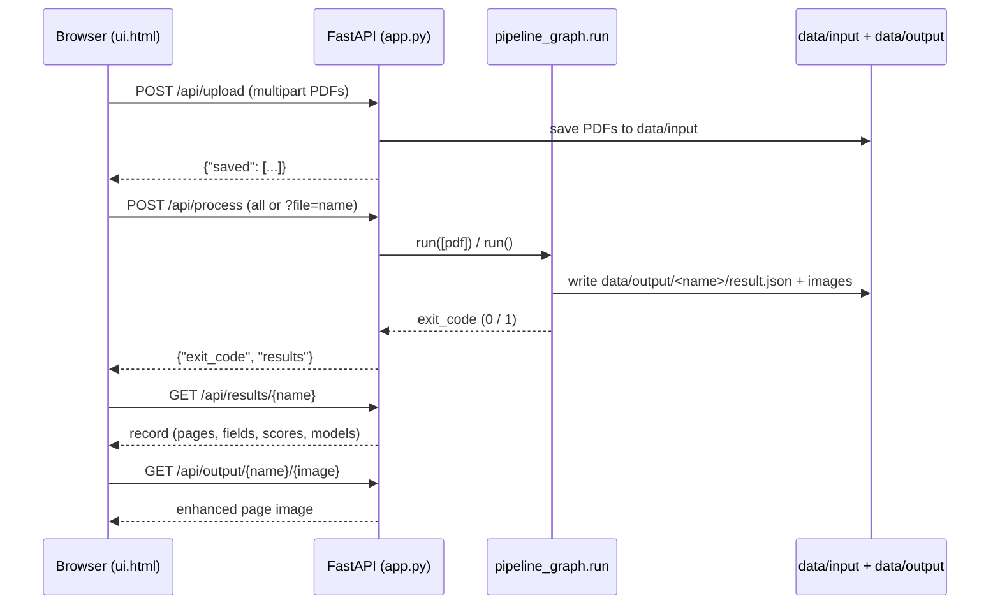

# Feature 7 — Web UI (`app.py`, `ui.html`)

> A one-page web interface: upload a PDF, process it, view the extracted data.

## Purpose

Give the demo a zero-setup browser front end: upload PDFs into `data/input`, run the exact same six-step LangGraph pipeline the CLI uses (`src.pipeline_graph.run`), and browse the extracted data per document — enhanced page image, quality score, model used, and every extracted field with its confidence — without touching the terminal. Run with `python app.py` and open http://127.0.0.1:8000.

## How It Works

Server side — **FastAPI** served by **uvicorn** (`app.py`), with stdlib `json`/`pathlib` only:

1. `app.py` imports `src.config` (paths from `.env`) and `run` from `src.pipeline_graph` (`app.py:19-20`) and creates the app instance `FastAPI(title="DocExtract Demo")` (`app.py:22`). `UI_PATH` points at `ui.html` next to `app.py` (`app.py:24`).
2. `GET /` (`index`, `app.py:49-52`) reads `ui.html` from disk on every request and returns it as an `HTMLResponse`. The whole UI is this single file — there is no static mount, template engine, or build step.
3. `GET /api/files` (`list_files`, `app.py:55-65`) ensures `data/input` exists and lists its `*.pdf` files (sorted), returning `{"files": [{"name", "size"}]}` so the page can offer a per-file process button.
4. `POST /api/upload` (`upload`, `app.py:68-80`) receives multipart form field `files` (`list[UploadFile]`). Each filename is basenamed and passed through `_safe_name` (`app.py:27-32`), which rejects anything containing folders/path tricks (`.` and `..` included) with HTTP 400; a name not ending in `.pdf` (case-insensitive) gets HTTP 422. The bytes are written verbatim to `data/input/<name>` — the same folder `main.py` reads — so web-uploaded and hand-copied PDFs behave identically. Returns `{"saved": [names]}`.
5. `POST /api/process` (`process`, `app.py:83-95`) triggers the pipeline **synchronously**. With query parameter `?file=<name>.pdf` it validates the name, checks `data/input/<name>` exists (HTTP 404 otherwise) and calls `run([pdf_path])`; without `file` it calls `run()`, which processes every PDF in `data/input`. `run` (`src/pipeline_graph.py:212`) invokes the compiled LangGraph once per PDF (convert → enhance → assess → route → extract → output) and returns a shell-style exit code: `0` if all succeeded, `1` if any failed. The HTTP request blocks until the run finishes; pipeline progress prints to the terminal running `app.py` (the UI status line tells the user to watch it).
6. The process response is `{"exit_code": int, "results": [...]}` where `results` comes from `_results()` (`app.py:35-46`): it walks `data/output/`, and for every `<name>/result.json` directory (sorted) parses the JSON and adds `"name": <directory name>`, so the client can list processed documents without knowing their names in advance.
7. `GET /api/results` (`results`, `app.py:98-101`) returns the same `{"results": [...]}` list for the data-view document buttons.
8. `GET /api/results/{name}` (`result`, `app.py:104-114`) sanitizes `name`, reads `data/output/<name>/result.json`, adds `"name"`, and returns the full extraction record (HTTP 404 if there is no result file).
9. `GET /api/output/{name}/{file_name}` (`output_file`, `app.py:117-126`) serves one file from `data/output/<name>/` via `FileResponse` — this is how the enhanced page images reach the browser so the data view can show the page next to its fields. Both path segments go through `_safe_name`; missing file gives HTTP 404.
10. `python app.py` starts `uvicorn.run(app, host="127.0.0.1", port=8000)` (`app.py:129-130`).

Front end — one inline script in `ui.html` (no framework, `fetch` + DOM template strings):

1. On load the page calls `loadFiles()` → `GET /api/files` and `loadResults()` → `GET /api/results` (`ui.html:173-174`), rendering a "process" chip per input PDF (`<name> - process`) and a document-name chip per result (label = `record.document`); a load failure on boot is silently ignored.
2. **Step 1 — Upload**: the "Upload" button opens a hidden `<input type="file" accept=".pdf" multiple>`; the `change` listener fires `upload()` (`ui.html:171`), which POSTs the chosen files as `FormData` (field `files`) to `/api/upload`, shows `Uploaded: …` or the server's error `detail` in red, clears the input, and reloads the file chips (`ui.html:94-112`).
3. **Step 2 — Process**: "Process all" POSTs `/api/process`; each per-file chip POSTs `/api/process?file=<name>` (`processFiles`, `ui.html:114-137`). The button is disabled while waiting and the status line points at the terminal. On completion the status shows `Done.` when `exit_code === 0`, else `Finished with failures - see the terminal.`; `loadResults()` then refreshes the chips and, for a single-file run, auto-opens that document's detail by matching `r.name === name` with the `.pdf` suffix stripped (`ui.html:127-130`).
4. **Step 3 — Data view**: clicking a document chip runs `showResult(name)` (`ui.html:139-159`) → `GET /api/results/<name>`. For each entry of `record.pages` it renders a card with the enhanced page image (`/<page.image>">`), a heading `Page N - score <quality_score> (<quality_tier>) - <model>`, and a table over `page.extracted_fields`: field name, value (`null` shown as italic *null*), and the matching `page.field_confidence_scores[key]` (missing keys default to `0`).
5. All data-derived HTML is passed through `escapeHtml` (`ui.html:69-73`) before insertion; a single delegated click listener dispatches the `data-action` attributes (`ui.html:161-169`).

## API Endpoints

All error responses use FastAPI's `{"detail": "<message>"}` shape.

| Method | Path | Purpose | Request shape | Response shape |
|---|---|---|---|---|
| GET | `/` | Serve the single UI page | — | `text/html` — contents of `ui.html` |
| GET | `/api/files` | List PDFs in `data/input` | — | `{"files": [{"name": str, "size": int}, ...]}` |
| POST | `/api/upload` | Save uploaded PDFs to `data/input` | multipart/form-data, field `files` (one or more PDF parts) | `{"saved": [str, ...]}` |
| POST | `/api/process` | Run the pipeline (all PDFs or one) | optional query `file=<name>.pdf` | `{"exit_code": 0\|1, "results": [record, ...]}` |
| GET | `/api/results` | List processed documents | — | `{"results": [record, ...]}` |
| GET | `/api/results/{name}` | One document's full extraction record | path `name` = output folder name | `result.json` fields + `"name": str` — includes `document` and `pages[].{page, image, quality_score, quality_tier, model, extracted_fields, field_confidence_scores}` |
| GET | `/api/output/{name}/{file_name}` | Serve one file from `data/output/<name>/` (page images) | path `name`, `file_name` | raw file bytes (`FileResponse`) |

Each `record` in the results lists is the parsed `result.json` plus a `"name"` key (the output folder name). `extracted_fields` is a `field → value` map and `field_confidence_scores` a `field → number` map.

## UI Workflow (three steps)

1. **1 · Upload** — Click *Upload*, pick one or more PDFs (the file dialog only offers `.pdf`). They are saved to `data/input` and appear as chips with a *process* action. The status line shows `Uploaded: <names>` or the error.
2. **2 · Process** — Click *Process all* to run every PDF in `data/input`, or a file's *process* chip to run just that one. The button is disabled while the pipeline runs; the terminal shows each feature as it executes. When the fetch returns, the status shows `Done.` or `Finished with failures - see the terminal.`
3. **3 · Data view** — Click a document chip to load its record. Each page renders as a card: the enhanced page image on the left, a heading with the page number, quality score and tier, and the model used, plus a table of extracted fields with value and confidence. After a single-file run this document opens automatically.

## Inputs & Outputs

| Item | Direction | Location / channel | Description |
|---|---|---|---|
| Uploaded PDF(s) | Input (browser → server) | multipart field `files` → `data/input/<name>.pdf` | Plain `.pdf` filenames only; written byte-for-byte |
| Existing PDFs | Input | `data/input/*.pdf` | Listed by `/api/files`; the same folder `main.py` uses |
| Pipeline run | Processing | `src.pipeline_graph.run` | Six-step LangGraph per PDF; prints progress to the `app.py` terminal; returns exit code `0`/`1` |
| Extraction record | Output (server → browser) | `data/output/<name>/result.json` | Full record (`document`, per-page fields, scores, models) with `"name"` added when served |
| Enhanced page images | Output (server → browser) | `data/output/<name>/<page.image>` via `/api/output/...` | Shown beside the extracted fields |
| Browser data view | Output | section 3 of `ui.html` | Per page: image, `Page N - score S (tier) - model`, table Field / Value / Confidence |

## Configuration

- **Host / port**: hardcoded in the entrypoint — `uvicorn.run(app, host="127.0.0.1", port=8000)` (`app.py:129-130`). The documented URL is http://127.0.0.1:8000 (`app.py:7`). Not configurable via environment variables.
- **Path keys** (loaded through `src/config.py` from `.env`; the web layer uses exactly these two):
  - `INPUT_DIR` — default `<project>/data/input` (`src/config.py:42`); where uploads land and `/api/files` looks.
  - `OUTPUT_DIR` — default `<project>/data/output` (`src/config.py:43`); where `_results()` and the result/output routes look.
- `UI_PATH` is derived from `__file__` (`app.py:24`) and is not configurable.
- All other `.env` keys (API key, base URL, model selection, DPI, …) apply indirectly, because processing calls the same `run` as `main.py`.

## Error Handling & Edge Cases

- **Path tricks in names** — `_safe_name` (`app.py:27-32`) rejects any name that is not a plain basename or equals `.`/`..` with HTTP 400 `invalid file name`. It is applied to uploads, the `file` query parameter, and both path parameters of `/api/results/{name}` and `/api/output/{name}/{file_name}`; the docstring calls it "the one security check the UI needs" because browser-supplied names go into file paths.
- **Non-PDF upload** — HTTP 422 `'<name>' is not a PDF` (`app.py:76-77`); an empty filename lands in the same branch.
- **Missing PDF / result / output file** — HTTP 404 (`app.py:90-91`, `app.py:110-111`, `app.py:124-125`) with details `file not found` / `result not found` / `file not found`.
- **Client-side error display** — the `api()` helper (`ui.html:59-67`) turns non-OK responses into an `Error` carrying the JSON `detail` (or status text); `upload()`/`processFiles()` render it as a red `.error` span in the matching section's status line. `processFiles()` re-enables its button in a `finally` block (`ui.html:134-136`).
- **Pipeline failures** — `run` returns `1` when any PDF fails; the UI then shows `Finished with failures - see the terminal.` (`ui.html:125-126`). Per-file error messages stay in the terminal; the UI does not surface them.
- **Empty states** — no PDFs in `data/input` → `No PDFs in data/input yet.`; no results → `No results yet.` (`ui.html:81`, `ui.html:90`).
- **Null / missing data** — a `null` field value renders as italic *null*; a missing confidence key is shown as `0` (`ui.html:144-145`).
- **Corrupt `result.json`** — `_results()`/`result()` call `json.loads` without a try/except (`app.py:43`, `app.py:112`), so a malformed file surfaces as an unhandled server error rather than a friendly message.
- **Synchronous processing** — `/api/process` blocks until the whole run completes; there is no job queue, progress endpoint, or polling — the browser simply waits on the fetch.

## API Reference

| Symbol | Kind | Route | Location | Description |
|---|---|---|---|---|
| `app` | FastAPI instance | — | `app.py:22` | `FastAPI(title="DocExtract Demo")` |
| `UI_PATH` | constant | — | `app.py:24` | Absolute path to `ui.html` beside `app.py` |
| `_safe_name` | helper | — | `app.py:27` | Rejects path tricks in names → HTTP 400 |
| `_results` | helper | — | `app.py:35` | Collects every `data/output/<name>/result.json`, adds `"name"` |
| `index` | route | `GET /` | `app.py:49` | Returns `ui.html` as `HTMLResponse` |
| `list_files` | route | `GET /api/files` | `app.py:55` | Lists `*.pdf` in `data/input` with sizes |
| `upload` | route | `POST /api/upload` | `app.py:68` | Saves multipart PDFs into `data/input` |
| `process` | route | `POST /api/process` | `app.py:83` | Calls `run([path])` or `run()`; returns `exit_code` + fresh results |
| `results` | route | `GET /api/results` | `app.py:98` | Lists all result records |
| `result` | route | `GET /api/results/{name}` | `app.py:104` | One record from `data/output/<name>/result.json` |
| `output_file` | route | `GET /api/output/{name}/{file_name}` | `app.py:117` | `FileResponse` for one output file (enhanced page image) |
| `__main__` block | entrypoint | — | `app.py:129` | `uvicorn.run(app, host="127.0.0.1", port=8000)` |

## Notes & Limitations

- The UI is a single static page with one inline script (fetch + template strings) — no framework, no build step, no JavaScript dependencies.
- No authentication; the server deliberately binds to `127.0.0.1` only (`app.py:130`).
- Processing is synchronous with no progress API; the terminal running `app.py` is the only place that shows the current pipeline feature while a run is in flight.
- Uploads overwrite an existing `data/input/<name>` without warning (`write_bytes`, `app.py:78`).
- The data view is read-only: there is no field editing, per-page re-run, or deletion of results; re-running a document overwrites its `data/output/<name>/` contents via the pipeline.
- The auto-open after processing only happens for single-file runs and matches by stripping the `.pdf` suffix from the requested filename (`ui.html:128`) — the output folder is the PDF stem.
- Only `.pdf` files are accepted, enforced both by `accept=".pdf"` in the file picker and by the server-side suffix check.
- Result listing is filesystem-driven (`_results()`); documents processed outside the UI (e.g. `python main.py`) appear in the data view automatically.
